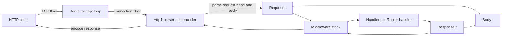

# Initial Architecture

## Status

Draft

## Context

Choku starts from an empty Git repository and targets OCaml 5.4 with Eio. The
project should provide an HTTP server without depending on existing OCaml HTTP
server stacks such as `cohttp`, and without using alternative concurrency
runtimes such as `lwt` or `async`.

## Goals

- Define a small server-first architecture that maps naturally to Eio fibers,
  switches, flows, and cancellation.
- Keep parsing, request handling, response writing, and connection lifecycle
  responsibilities separate.
- Make protocol behavior testable without opening real network sockets where
  possible.
- Leave room for HTTP/1.1 first, with later extension points for HTTP/2,
  HTTP/3, TLS, observability, benchmarks, client support, and additional
  protocol features.

## Non-Goals

- Supporting `cohttp`, `lwt`, or `async` compatibility layers.
- Implementing HTTP/2 or HTTP/3 in the initial design.
- Implementing an HTTP client in the first server milestone.
- Implementing TLS in the first server milestone.
- Providing a full web framework, router, template system, or middleware stack
  before the core server behavior is specified.

## Candidate Module Boundaries

- `Choku`: public entry point.
- `Choku.Server`: accept loop, connection lifecycle, handler invocation.
- `Choku.Client`: future HTTP client API built on shared HTTP types.
- `Choku.Handler`: low-level request-to-response handler contract.
- `Choku.Middleware`: handler-to-handler transformations.
- `Choku.Method`: HTTP method values.
- `Choku.Headers`: HTTP header values.
- `Choku.Status`: HTTP status values.
- `Choku.Body`: buffered body values, with room for future streaming.
- `Choku.Request`: HTTP request values.
- `Choku.Response`: HTTP response values.
- `Choku.Http1`: HTTP/1 parser and encoder.
- `Choku.Http2`: future HTTP/2 framing and stream handling.
- `Choku.Http3`: future HTTP/3 transport integration and stream handling.
- `Choku.Body`: streaming request and response body abstractions.
- `Choku.Error`: public and internal error classification.
- `Choku.Test_support`: helpers for protocol-level tests.

These names are provisional until the first implementation plan confirms package
layout and build tooling.

`Choku.Method`, `Choku.Headers`, `Choku.Status`, `Choku.Body`,
`Choku.Request`, and `Choku.Response` form the shared HTTP value layer. They
are exposed as top-level modules for ergonomic use, and should stay useful to
both the server and the future client. Server-specific lifecycle concerns belong
in `Choku.Server`; future client connection pooling, redirect policy, and TLS
configuration should belong in `Choku.Client`.

HTTP version-specific parsing, framing, stream multiplexing, flow control, and
transport integration should stay outside the shared HTTP value layer. HTTP/1.1
belongs in `Choku.Http1`. Future HTTP/2 and HTTP/3 support should add
version-specific modules that translate between protocol frames/streams and the
shared request/response values where that mapping is valid.

## Architecture Overview

The server owns listening, connection fibers, and request lifecycle. `Http1`
owns HTTP/1.1 parsing and encoding. Handlers, middleware, and routers operate on
the shared HTTP value layer and do not depend on protocol-specific parser state.
Future HTTP/2, HTTP/3, and client modules should translate to or from the same
shared values where their protocol semantics allow it.

## Concurrency Model

Each accepted connection should run in an Eio fiber attached to the caller-owned
switch passed to the server. Connection-local resources must be tied to the
connection scope. Request handling should honor Eio cancellation and must not
require a secondary runtime.

## Validation

The initial implementation plan should introduce:

- a build system;
- unit tests for HTTP value types and parser behavior;
- integration tests for a minimal Eio server loop;
- an example server that can be manually exercised.

## Open Questions

- Should the first parser be handwritten or built with a parser combinator?
- What transport abstraction should a future HTTP client use for plain TCP and
  TLS without forcing TLS into the first server milestone?
- Which shared abstractions need to change before HTTP/2 multiplexing or HTTP/3
  transport support can be added?
