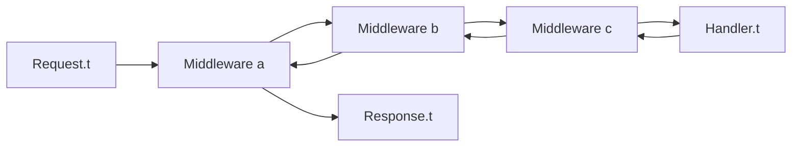

# Minimal Server, Handler, and Middleware API

## Status

Draft

## Context

Choku should first establish a small Eio-native HTTP server API before adding
a higher-level routing DSL. Languages and frameworks such as Go, Sinatra, Hono,
and Akka HTTP show that production HTTP stacks often benefit from both low-level
handler contracts and higher-level routing layers. Choku should keep that
separation from the beginning without requiring the routing layer in the first
milestone.

Eio uses direct style with structured concurrency. Choku should not expose
`Lwt.t`, `Async.Deferred.t`, callback pyramids, or framework-specific routing
concepts in the core handler contract.

## Goals

- Define a minimal server API that can run a plain OCaml function as an HTTP
  handler.
- Keep the first handler contract small enough to test without a live socket.
- Add middleware from the start as a first-class transformation over handlers.
- Leave room for a future Router DSL that compiles down to the same handler
  contract.
- Keep HTTP value types reusable by a future HTTP client.
- Keep Eio capabilities explicit at server boundaries and ordinary direct-style
  OCaml inside handlers.

## Non-Goals

- Providing a routing DSL in the first server milestone.
- Providing an HTTP client in the first server milestone.
- Providing a web framework, controller layer, template layer, or application
  container.
- Copying Go's mutable `ResponseWriter` model as the primary API.
- Implementing HTTP/2 or HTTP/3 in the first server milestone.
- Designing TLS, compression, or observability integrations.

## Proposed Design

The first public server API should revolve around three concepts:

- `Request.t`: an immutable request value plus an explicit body abstraction.
- `Response.t`: a response value that describes status, headers, and body.
- `Handler.t`: a function from request to response.

`Request.t` and `Response.t` are the server/application request and response
values exposed as top-level modules under the `Choku` library for ergonomic
use. Shared lower-level protocol values such as `Method.t`, `Headers.t`,
`Status.t`, and `Body.t` should stay reusable where their contracts fit.

Middleware should be a function from handler to handler:

```ocaml
module Handler : sig
  type t = Request.t -> Response.t
end

module Middleware : sig
  type t = Handler.t -> Handler.t

  val identity : t
  val compose : t -> t -> t
  val apply : t list -> Handler.t -> Handler.t
end
```

The server should accept an already-composed handler:

```ocaml
module Server : sig
  type t

  val create :
    ?max_request_body_size:int ->
    ?middlewares:Middleware.t list ->
    handler:Handler.t ->
    unit ->
    t

  val run :
    sw:Eio.Switch.t ->
    net:[> Eio.Net.ty ] Eio.Resource.t ->
    addr:Eio.Net.Sockaddr.stream ->
    t ->
    unit
end
```

The caller owns the Eio switch passed to `Server.run`. Choku attaches the
listening socket and per-connection fibers to that switch, but does not close the
switch itself. `Server.run` blocks until the switch is cancelled, the listening
socket fails, or a future explicit shutdown API requests termination. The first
implementation milestone does not need an explicit shutdown function; structured
cancellation through the caller-owned switch is the shutdown mechanism.

`Server.create ?max_request_body_size ?middlewares ~handler ()` must compose
`middlewares` exactly once using `Middleware.apply middlewares handler` and store
the resulting handler. `max_request_body_size` defaults to `1_048_576` bytes. A
request whose declared or decoded body exceeds the configured limit is rejected
before handler invocation.

Application dependencies should normally be captured by closure:

```ocaml
let make_handler clock =
  fun request ->
    let now = Eio.Time.now clock in
    Response.text (Printf.sprintf "now=%f" now)
```

This keeps the core handler simple while still allowing Eio resources to be used
where the application owns them.

## Router Compatibility

The first milestone should not include `Router`, but the handler contract should
make a future router straightforward:

```ocaml
module Router : sig
  type t

  val get : string -> Handler.t -> t -> t
  val post : string -> Handler.t -> t -> t
  val to_handler : t -> Handler.t
end
```

Because `Router.to_handler` returns `Handler.t`, routing remains an optional
layer rather than a server dependency.

## Client And TLS Compatibility

The first milestone should not include an HTTP client. However, Choku should
expect to add one because reverse proxy and service-to-service use cases need
outbound HTTP. The future client should use separate client request and
response types while reusing shared protocol values where their contracts fit:

- `Client.Request.t` for outbound request construction;
- `Client.Response.t` for inbound client responses;
- `Method.t`, `Headers.t`, `Status.t`, and buffered `Body.t` for protocol
  values.

Client-only concerns should not leak into the server API. Future client
configuration should own concerns such as target URI parsing, connection reuse,
redirect behavior, proxy behavior, and TLS verification policy.

TLS is not part of the first server milestone. The first server implementation
may listen on plain TCP only. The design should still avoid assuming that every
HTTP connection is backed directly by a raw socket. Protocol read/write code
should operate on Eio flows so a future TLS transport can wrap the underlying
connection before HTTP parsing and encoding.

The future client will likely need TLS earlier than the server because many
outbound URLs use `https`. That requirement should be handled in a separate
client/TLS design and ADR before implementation. Until then, no public API
should promise HTTPS support.

## Protocol Version Compatibility

The first milestone should implement HTTP/1.1 only. The public handler and
middleware contracts should remain protocol-neutral: handlers operate on
server/application `Request.t` and `Response.t` values rather than HTTP/1.1
parser state, connection state, or socket state.

HTTP/2 and HTTP/3 are not part of the first server milestone, but the design
should avoid unnecessary HTTP/1.1 coupling:

- server HTTP value types are exposed as top-level modules such as
  `Choku.Request` and `Choku.Response`;
- HTTP/1.1 parsing and encoding belong in `Choku.Http1`;
- future HTTP/2 framing, stream multiplexing, and flow control should belong in
  a version-specific module such as `Choku.Http2`;
- future HTTP/3 support should be designed separately because it combines HTTP
  semantics with QUIC transport concerns;
- middleware should not depend on connection-level details that differ across
  HTTP versions.

Some HTTP/2 and HTTP/3 features, especially multiplexing, streaming bodies,
trailers, and flow control, may require widening body and server lifecycle
abstractions. Those changes should be handled in a later design doc and ADR
before implementation.

## Middleware Semantics

Middleware order should be explicit and documented. `Middleware.apply [a; b] h`
should produce `a (b h)`, so the first middleware in the list observes the
request first and the response last. This matches common wrapping intuition and
keeps logging, error handling, and instrumentation middleware predictable.

`Middleware.identity h` is `h`. `Middleware.compose a b h` is `a (b h)`.
`Middleware.apply middlewares h` folds with `compose` in list order, so
`Middleware.apply [a; b; c] h` is `a (b (c h))`.

Examples of middleware that should be possible without special server hooks:

- exception-to-response mapping;
- request logging;
- response header injection;
- basic request metrics;
- method or path guards.

Connection-level concerns such as socket accept loops, per-connection switches,
read timeouts, and protocol errors should remain in `Server` or HTTP protocol
modules rather than middleware.

## Handler And Middleware Flow



`Middleware.apply [a; b; c] handler` builds `a (b (c handler))`. The first
middleware in the list sees the request before later middleware and sees the
response after later middleware. The server composes the stack once at
`Server.create` time and stores the resulting handler.

## Minimal HTTP Type Contract

`Request.t`, `Response.t`, and body types should be abstract in public
interfaces. The first implementation should expose constructors and accessors
rather than public record fields or public variant representation. This keeps
room for future streaming support and shared lower-level protocol reuse without
forcing users to pattern match on internal representation.

First milestone request contract:

```ocaml
module Method : sig
  type t =
    | GET
    | HEAD
    | POST
    | PUT
    | PATCH
    | DELETE
    | OPTIONS
    | Other of string

  val to_string : t -> string
  val of_string : string -> t
end

module Headers : sig
  type t

  val empty : t
  val add : string -> string -> t -> t
  val set : string -> string -> t -> t
  val get : string -> t -> string option
  val get_all : string -> t -> string list
  val to_list : t -> (string * string) list
end

module Request : sig
  type t

  val make :
    meth:Method.t ->
    target:string ->
    headers:Headers.t ->
    body:Body.t ->
    t

  val meth : t -> Method.t
  val target : t -> string
  val path : t -> string
  val path_segments : t -> string list
  val query_string : t -> string option
  val headers : t -> Headers.t
  val body : t -> Body.t
end

module Request_head : sig
  type t

  val make : meth:Method.t -> target:string -> headers:Headers.t -> t
  val meth : t -> Method.t
  val target : t -> string
  val path : t -> string
  val query_string : t -> string option
  val headers : t -> Headers.t
end
```

`Headers.get` and `Headers.get_all` use case-insensitive field-name lookup while
preserving insertion order for `to_list`. `Headers.add name value headers`
appends a new field after existing fields. `Headers.set name value headers`
removes all existing fields whose names match case-insensitively, then appends
the new field at the end. `Headers.get name headers` returns the first matching
value in insertion order after applying those rules. `Headers.get_all name
headers` returns all matching values in insertion order. `Response.with_header`
uses `Headers.set`.

HTTP methods are case-sensitive. `Method.of_string` maps exact uppercase known
methods such as `"GET"` and `"POST"` to their constructors. Any other valid HTTP
method token becomes `Other token` and preserves the original case. Invalid
method tokens raise `Invalid_argument`.

`Request.target` is the raw request-target from the request line. The first
milestone supports origin-form targets. `Request.make` validates `target` and
raises `Invalid_argument` if it is not a slash-prefixed path with an optional
query string, or if it contains a fragment marker, control bytes, spaces, or
DEL. `Request.path` returns the origin-form path without the query string; for
example, `"/items?a=1"` becomes `"/items"`. `Request.path_segments` returns
`Request.path` split into URL path segments without the leading slash. The root
path `"/"` becomes `[]`; `"/users/42"` becomes `["users"; "42"]`; empty
segments are preserved, so `"/users/"` becomes `["users"; ""]`. It does not
percent-decode, normalize dot segments, or collapse repeated slashes.
`Request.query_string` returns the raw query component without the leading `?`.
It returns `None` when the target has no query component and `Some ""` for a
target ending with `?`.
`Request_head.query_string` exposes the same raw query component before body
delivery. `Request_head` intentionally keeps only the pre-body metadata
accessors needed by body-mode selectors; a symmetric
`Request_head.path_segments` can be added when selector ergonomics need it.
Unsupported request-target forms are rejected by the HTTP/1 parser before a
`Request.t` reaches a handler.

This first milestone target contract is server-oriented. HTTP Client uses a
separate `Client.Request.t` so URI-based outbound requests can evolve without
changing the server handler contract.

First milestone response contract:

```ocaml
module Status : sig
  type t

  val code : t -> int
  val reason : t -> string
  val of_code : int -> t

  val ok : t
  val bad_request : t
  val not_found : t
  val payload_too_large : t
  val internal_server_error : t
end

module Response : sig
  type t

  val make :
    ?headers:Headers.t ->
    ?body:Body.t ->
    Status.t ->
    t

  val text : ?status:Status.t -> string -> t
  val status : t -> Status.t
  val headers : t -> Headers.t
  val body : t -> Body.t
  val with_header : string -> string -> t -> t
end
```

`Status.of_code` accepts integers from 100 through 599 and raises
`Invalid_argument` outside that range. Known status codes use their standard
reason phrase. Unknown but valid codes use an empty reason phrase. Common
standard status codes are exposed as named `Status.t` values so handlers do not
need to construct them from integers. `Status.class_` maps any valid status to
its HTTP status code class.

First milestone body contract:

```ocaml
module Body : sig
  type t

  val empty : t
  val string : string -> t
  val to_string : t -> string
end
```

Request bodies are buffered and replayable in the first milestone. The server
must enforce `Server.create`'s configurable maximum request body size before
constructing `Request.t`. The default limit is `1_048_576` bytes. Over-limit
requests do not invoke the handler; when possible, the server returns
`413 Payload Too Large` with `connection: close` and then closes the connection.
Streaming request and response bodies are deferred, but the abstract body type
preserves a path for adding streaming constructors later.

Test builders should use the same `make` functions so handler and middleware
tests can run without sockets.

## Error Semantics

Middleware may catch exceptions from the wrapped handler and convert them into
responses. If a non-cancellation exception escapes all middleware before a
response is written, the server should return this exact default response:

- status: `500 Internal Server Error`;
- headers: `content-type: text/plain; charset=utf-8` and `connection: close`;
- body: `Internal Server Error\n`.

After sending that response, the server should close the request connection.
If response writing has already started or socket writing fails, the server
should close the connection without attempting to synthesize another HTTP
response.

Exceptions matching `Eio.Cancel.Cancelled _` are cancellation signals. The server
must re-raise or otherwise preserve cancellation semantics rather than converting
them into HTTP 500 responses.

Protocol parse errors, socket errors, write failures, and cancellation during IO
belong to server or protocol modules, not middleware.

For HTTP/1.1 server requests, the parser also requires exactly one non-empty
`Host` header before constructing `Request.t`. Missing, empty, or duplicate
`Host` headers are ordinary malformed request input and produce `400 Bad
Request` before handler invocation.

For explicit `HEAD` requests, the server serializes the same status and headers,
including the `Content-Length` corresponding to the response body, but omits the
body bytes on the wire. Automatic `HEAD` routing fallback for `GET` routes is a
separate router feature and remains deferred.

## Contracts

Public source interfaces should include block comments equivalent to these
contracts:

```ocaml
module Handler : sig
  (** A request handler runs inside the Eio fiber serving one HTTP request.

      The handler receives a request value and returns a response description.
      It may perform Eio operations directly using capabilities captured by
      closure. It must not depend on Lwt, Async, or another scheduler. *)
  type t = Request.t -> Response.t
end

module Middleware : sig
  (** Middleware transforms one handler into another handler.

      Middleware may inspect or replace the request before calling the wrapped
      handler, and may inspect or replace the response returned by it. It may
      also catch exceptions from the wrapped handler when implementing error
      handling policies. *)
  type t = Handler.t -> Handler.t

  (** [compose a b h] is [a (b h)]. *)
  val compose : t -> t -> t

  (** [apply [a; b; c] h] is [a (b (c h))]. *)
  val apply : t list -> Handler.t -> Handler.t
end

module Server : sig
  (** [run ~sw ~net ~addr server] accepts HTTP connections on [addr] using Eio.

      The caller owns [sw]. Choku attaches listener resources and connection
      fibers to that switch, but does not close it. The call runs until [sw] is
      cancelled, the listening socket fails, or a future shutdown API requests
      termination. *)
  val run :
    sw:Eio.Switch.t ->
    net:[> Eio.Net.ty ] Eio.Resource.t ->
    addr:Eio.Net.Sockaddr.stream ->
    t ->
    unit
end
```

`Request.t`, `Response.t`, and `Body.t` contracts should be documented in their
own `.mli` files with the same ownership and buffering semantics described
above.

## Alternatives Considered

- `ctx -> Request.t -> Response.t`: useful for server-owned request metadata,
  but premature before the first server contract exists. Request metadata can be
  carried on `Request.t`, and application dependencies can be captured by
  closure.
- `ResponseWriter.t -> Request.t -> unit`: close to Go, but more mutation-heavy
  and harder to test as a pure value-level contract. It may still be useful later
  as a streaming body implementation detail.
- Router-first API: convenient for applications, but it would entangle path
  matching with the server lifecycle before the low-level handler contract is
  stable.
- Client-first API: useful for reverse proxy work, but it would force target URI,
  connection pooling, and TLS decisions before the minimal server exists.
- Middleware as server hooks: less composable and harder to test than
  `Handler.t -> Handler.t`.

## Third-Party Review

Initial context-free sub-agent review found blocking ambiguity around switch
ownership, HTTP body contracts, middleware ordering consistency, and default
handler exception behavior. A second review found remaining ambiguity in
`Middleware.compose`, `Server.create`, minimal HTTP support types, path
derivation, and default 500 behavior. A third review requested tighter contracts
for headers, `Response.with_header`, `Method.of_string`, `Status.of_code`, and
`Request.make`. This document was updated to make those contracts explicit.
Final context-free re-review reported no blocking findings and confirmed that
the design and product spec are consistent enough to proceed toward an
implementation plan.

Additional context-free review of the future HTTP client and TLS compatibility
notes reported no blocking findings. The review confirmed that the initial
milestone remains server-only, shared HTTP value types are positioned for future
client reuse, TLS is deferred, and no public HTTPS support is promised.

Additional context-free review of HTTP/2 and HTTP/3 compatibility notes reported
no blocking findings. The review confirmed that the first milestone remains
HTTP/1.1 only, handler and middleware contracts stay protocol-neutral, shared
HTTP values remain outside `Http1`, and future version-specific modules own
framing, multiplexing, and transport concerns.

## Validation

The implementation plan should validate this design with:

- unit tests for middleware composition order;
- unit tests for request, response, and body constructors/accessors;
- unit tests for handler invocation without a socket;
- integration tests for `Server.run` with a minimal handler;
- interface comments checked into `.mli` files;
- formatter and static analysis commands once the OCaml toolchain exists.

## Open Questions

- Which shared HTTP type contracts will need widening when the HTTP client is
  designed?
- What transport abstraction should future TLS support use?
- Which handler, body, and lifecycle abstractions must widen before HTTP/2 or
  HTTP/3 support?
- Should `Request.t` expose the body as a pull-based stream, an eager value, or a
  hybrid body abstraction after the first buffered-body milestone?
- Should `Response.t` add streaming after the first implementation milestone?
- Should a later milestone add an explicit shutdown API beyond caller-owned
  switch cancellation?
